# Facets Store visual verification

These captures were taken from the locally running game while signed into the dedicated test account. The theme previews use the same profile, roll-stage and leaderboard renderers as equipped cosmetics; they are not isolated mockups.

## Store and My Cosmetics

| Desktop | Mobile |
|---|---|
| 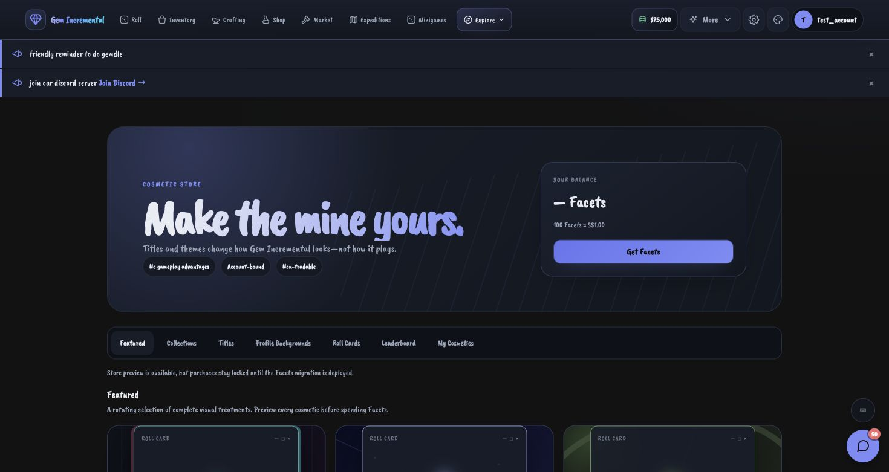 | 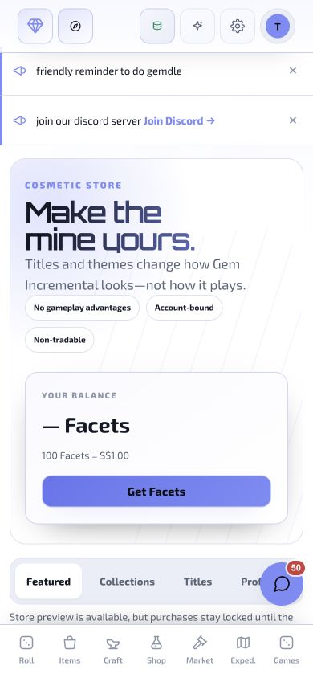 |
| 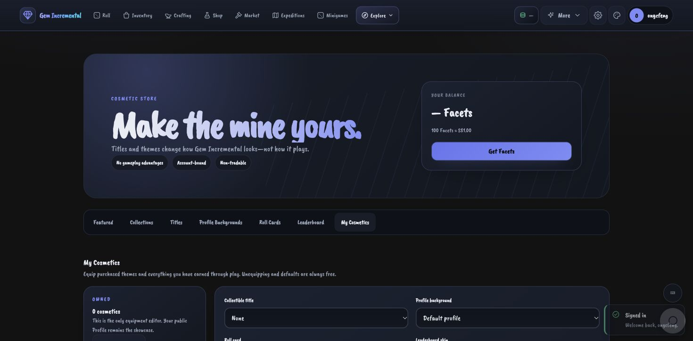 | 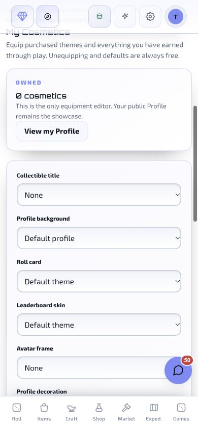 |

## Glitched

| Title and profile background | Roll card | Leaderboard skin |
|---|---|---|
| 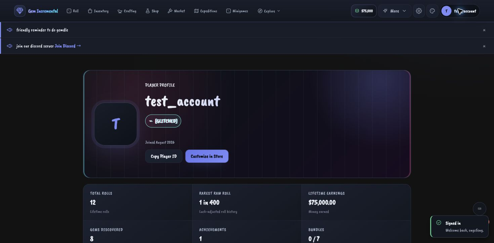 | 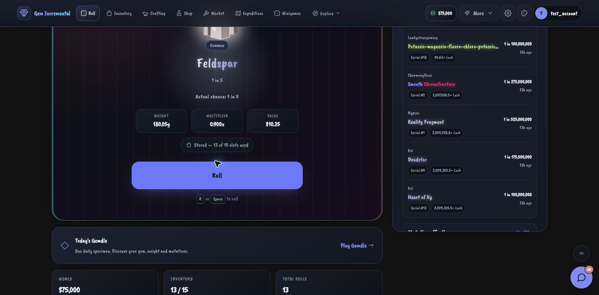 | 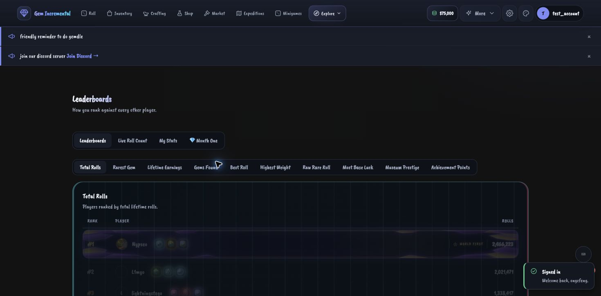 |

## Celestial

| Title and profile background | Roll card | Leaderboard skin |
|---|---|---|
| 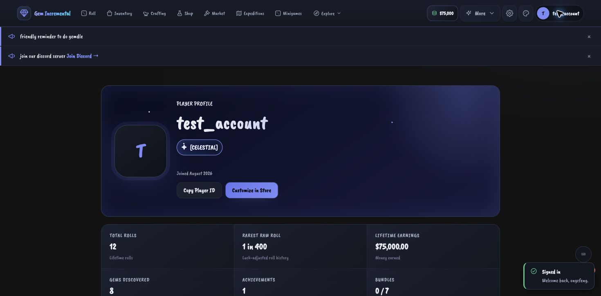 | 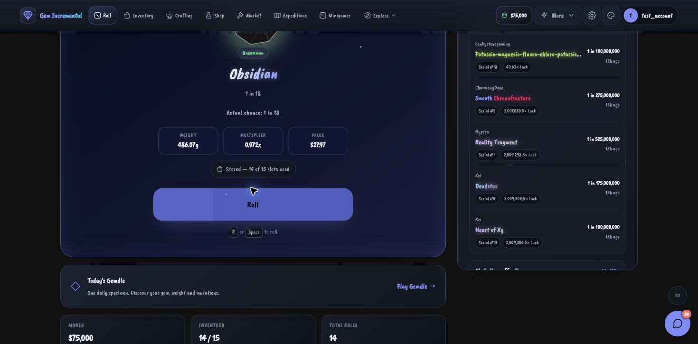 | 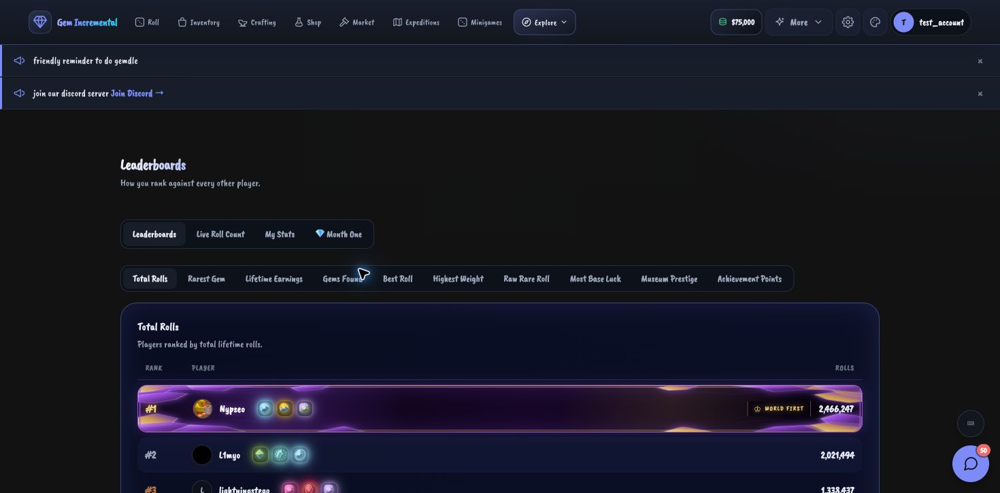 |

## Overgrown

| Title and profile background | Roll card | Leaderboard skin |
|---|---|---|
| 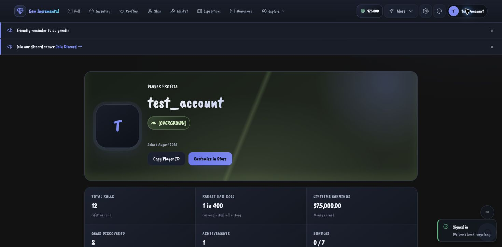 | 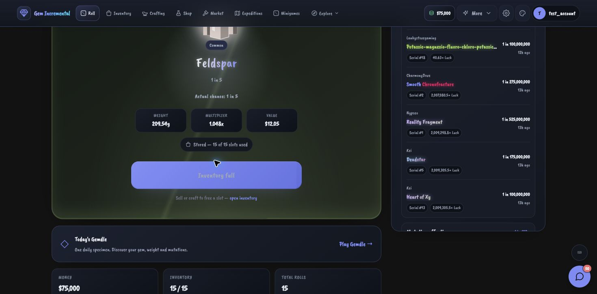 | 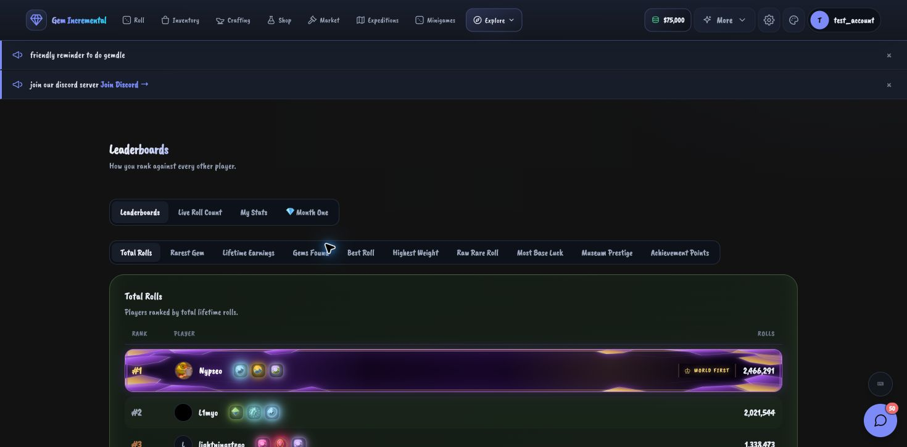 |

## Retro Desktop roll card

Retro Desktop adapts its window chrome and card interior to the game's appearance setting. Both captures show a real roll result.

| Dark | Light |
|---|---|
| 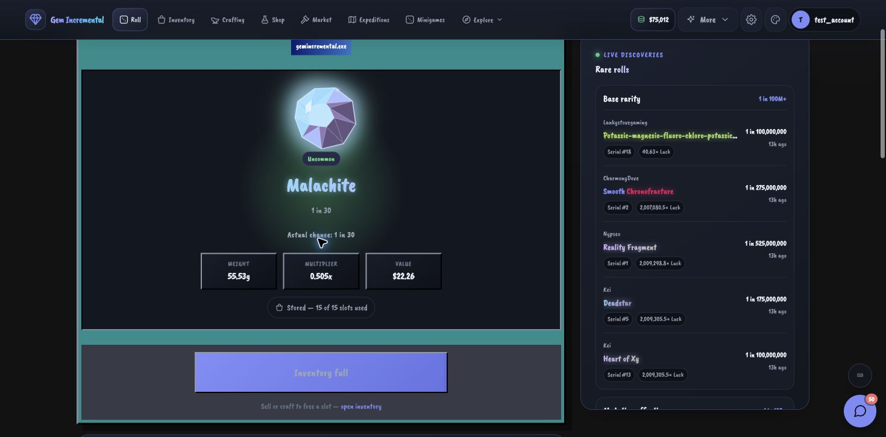 | 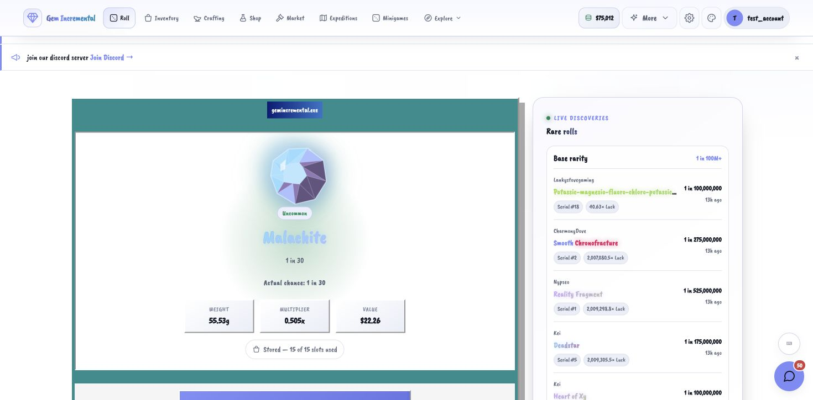 |

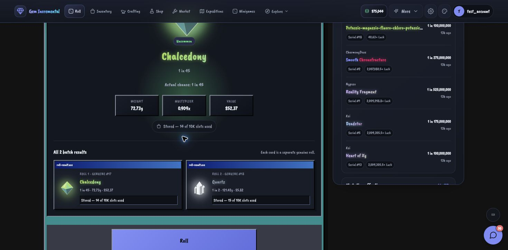

The batch capture is a real two-result roll: each result is presented as its own `roll-result.exe` window with its individual status line.
